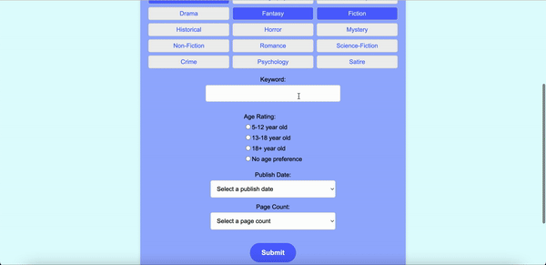

# 🐮 CowComic 📘

Welcome to CowComic, a React Web Application where users can get a book recommended after completing a survey! If users want to save their book recommendation, they have the option to register for an account/login to their existing account to save books.  

## Why "CowComic"?

Cal Poly Pomona, though known for broncos, has cute cow merchandise (stickers, plushies, etc.) to represent CPP. Since our website has to do with books, the name "CowComic" was created!

## CS4800 Software Engineering Project - Fall 2024
- Project Manager: Jared Escarcega
- Developer: Allison Ly
- Developer: Thu (Zoey) Nguyen
- Quality Assurance: Tam Dinh

## Tools/Resources
- React JS
- HTML/CSS
- Javascript
- OpenAI API
- Firebase
- Aseprite
- Visual Studio Code
- GitHub
- Figma

## Deployment Instructions

After pulling/downloading our code run the following commands in the terminal:

1. npm install
2. npm run dev

Then, click on the local host link to view the CowComic website

## Project Release Notes
1. CowComic Home Page
   
   
2. Survey

   

   - Users fill out preferred genres, keyword, age rating, publish date, and page count
   - Information sent to OpenAI API and results are from the API
   - Each genre has a corresponding icon
    
3. Login and Register

   
   
      - Users can login to existing account
   
   
      - Users can register for a new account

4. Saved Books

   
   
      - Example of logged in user's saved book page
